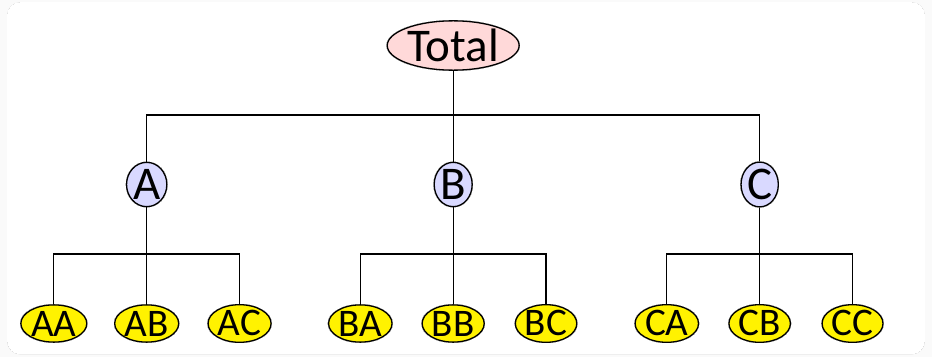

class: inverse
background-image: linear-gradient(to right, rgba(150, 150, 150, .1), rgba(150, 150, 150, .4)), url("resources/hourglass.jpg")
background-size: cover

```{r setup, include=FALSE}
options(htmltools.dir.version = FALSE, width = 120)

library(tidyverse)
library(knitr)
library(kableExtra)
library(fontawesome)
library(lubridate)
library(htmltools)

library(tsibble)
library(fasster)
library(fable)

opts_chunk$set(
  echo = FALSE, warning = FALSE, message = FALSE, comment = "#>",
  fig.path = 'figure/', cache.path = 'cache/', fig.align = 'center',
  fig.width = 12, fig.height = 4, fig.show = 'hold',
  cache = TRUE, external = TRUE, dev = 'svglite', dev.args = list(bg = "transparent")
)

mp4_vid <- function(src){
  HTML(
    paste0(
      '<video autoplay>
        <source src="', src, '" type="video/mp4">
      </video>'
    )
  )
}

hook_output <- knit_hooks$get("output")
knit_hooks$set(output = function(x, options) {
   lines <- options$output.lines
   if (is.null(lines)) {
     return(hook_output(x, options))  # pass to default hook
   }
   x <- unlist(strsplit(x, "\n"))
   more <- "..."
   if (length(lines)==1) {        # first n lines
     if (length(x) > lines) {
       # truncate the output, but add ....
       x <- c(head(x, lines), more)
     }
   } else {
     x <- c(more, x[lines], more)
   }
   # paste these lines together
   x <- paste(c(x, ""), collapse = "\n")
   hook_output(x, options)
 })

theme_set(
  theme_grey(base_size = 16) +
  theme(
    legend.position = "bottom",
    plot.background = element_rect(fill = "transparent"),
    legend.background = element_rect(fill = "transparent")
  )
)
```


```{css, echo=FALSE}
/* custom.css */
.left-code {
  color: #777;
  width: 40%;
  height: 92%;
  float: left;
}
.right-plot {
  width: 58%;
  float: right;
  padding-left: 1%;
}
```


.title[fable]
.sticker-float[]

## Probabilistic cross-temporal hierarchies

.bottom[
### Mitchell O'Hara-Wild (`r fa("twitter", fill="#1da1f2")`[@mitchoharawild](https://twitter.com/mitchoharawild))
### 27 October 2020
### Slides @ [slides.mitchelloharawild.com/isf2020](https://slides.mitchelloharawild.com/isf2020)
]

---
class: inverse
background-image: linear-gradient(to right, rgba(150, 150, 150, .1), rgba(150, 150, 150, .4)), url("resources/timezone.jpg")
background-size: cover

.title[Hello!]

---
class: inverse
background-image: linear-gradient(to right, rgba(150, 150, 150, .1), rgba(150, 150, 150, .4)), url("resources/timezone.jpg")
background-size: cover

# It's time to talk about time.

---
class: inverse
background-image: linear-gradient(to right, rgba(50, 50, 50, .1), rgba(200, 200, 200, .4)), url("resources/sparks.jpg")
background-size: cover

# Presentation driven development

A 'proof of concept' for what is to come.

**Everything** is subject to change, suggestions encouraged.

--

.sticker-float[]

---
class: center

## What is fable?

.sticker[]

--

.animated.fadeIn[
.sticker[]
.sticker[]
.sticker[]

## [tidyverts.org](http://www.tidyverts.org)
]

---

class: top

.sticker-float[]

# Tidy temporal data structure

### Domestic tourism in Australia

```{r tourism-data, echo = TRUE}
library(tsibble)
tourism
```

---

class: top

.sticker-float[]

# A peak at the features

### Compute features relating to STL decompositions

```{r tourism-features, echo = TRUE}
library(feasts)
tourism_features <- tourism %>% 
  features(Trips, feature_set(tags = "stl"))
```

```{r tourism-features-print, echo = FALSE}
tourism_features
```

---

class: top

.sticker-float[]

# A peak at the features

.full-width[
```{r tourism-features-plot, echo = TRUE}
library(ggplot2)
tourism_features %>% 
  ggplot(aes(x = trend_strength, y = seasonal_strength_year, colour = Purpose)) + 
  geom_point() + stat_density_2d(aes(fill = Purpose, alpha = ..level..), bins = 5, geom = "polygon") + 
  facet_wrap(vars(Purpose), nrow = 1) + coord_equal() + xlim(c(0,1)) + ylim(c(0,1))
```
]

---

class: top

.sticker-float[].sticker-float[]

# Total holidays across Australia

### Starting from the top

```{r tourism-total, echo = TRUE, fig.show='hide'}
library(dplyr)
aus_holiday <- tourism %>% 
  filter(Purpose == "Holiday") %>% 
  summarise(Trips = sum(Trips))

aus_holiday %>% 
  autoplot(Trips)
```

.flex-row[
```{r tourism-total-print, echo = FALSE}
aus_holiday
```
.full-width[
```{r tourism-total-plot, echo = FALSE}
aus_holiday %>% 
  autoplot(Trips)
```
]
]

---

class: top

.sticker-float[]

# Forecasting with fable

### Look at the data

<br>

.left-code[
```{r tourism-total-ets-data, eval=FALSE, echo=TRUE}
aus_holiday #<<
```
]
.right-plot[
```{r tourism-total-ets-data-output, ref.label="tourism-total-ets-data", echo=FALSE, cache=TRUE, fig.height = 6}
```
]


---

class: top

.sticker-float[]

# Forecasting with fable

### Specify and estimate a model

<br>

.left-code[
```{r tourism-total-ets-model, eval=FALSE, echo=TRUE}
aus_holiday %>% 
  model(ETS(Trips)) #<<
```
]
.right-plot[
```{r tourism-total-ets-model-output, ref.label="tourism-total-ets-model", echo=FALSE, cache=TRUE, fig.height = 6}
```
]

---

class: top

.sticker-float[]

# Forecasting with fable

### Make some forecasts

<br>

.left-code[
```{r tourism-total-ets-forecast, eval=FALSE, echo=TRUE}
aus_holiday %>% 
  model(ETS(Trips)) %>% 
  forecast(h = "3 years") #<<
```
]
.right-plot[
```{r tourism-total-ets-forecast-output, ref.label="tourism-total-ets-forecast", echo=FALSE, cache=TRUE, fig.height = 6}
```
]

---

class: top

.sticker-float[]

# Forecasting with fable

### See the results!

<br>

.left-code[
```{r tourism-total-ets-plot, eval=FALSE, echo=TRUE}
aus_holiday %>% 
  model(ETS(Trips)) %>% 
  forecast(h = "3 years") %>% 
  autoplot(aus_holiday) #<<
```
]
.right-plot[
```{r tourism-total-ets-plot-output, ref.label="tourism-total-ets-plot", echo=FALSE, cache=TRUE, fig.height = 6}
```
]

---
class: inverse, center
background-image: linear-gradient(to right, rgba(50, 50, 50, .5), rgba(50, 50, 50, .5)), url("resources/hierarchy.jpg")
background-size: cover

# Forecasting hierarchical series

--

`aggregate_key()`

---

# Forecasting hierarchical series

```{r, eval = FALSE, echo = TRUE}
data %>% 
  aggregate_key(grp_a / grp_b, y = sum(y))
```




---

# Consider tourism by state

```{r ausmap, echo=FALSE, message=FALSE, fig.height=5}
library(sf)
# Use Okabe-Ito color-blind friendly color palette
state_colors <- c(
  `New South Wales` = "#56b4e9",
  `Victoria` = "#0072b2",
  `Queensland` = "#009e73",
  `South Australia` = "#f0e442",
  `Northern Territory` = "#d55e00",
  `Western Australia` = "#e69f00",
  `Tasmania` = "#cc79a7",
  `Australian Capital Territory` = "#cccccc"
)
read_sf("tourism/Tourism_Regions_2020.shp") %>%
  rename(State = "STE_NAME16") %>%
  ggplot() +
  geom_sf(aes(fill = State), alpha = 0.8) +
  theme_void() +
  scale_fill_manual(values = state_colors)
```

.footnote[*Map courtesy of Rob Hyndman*]
---

# Consider tourism by state

.pull-left[
```{r tourism-agg, echo = TRUE}
tourism_state <- tourism %>% 
  aggregate_key(State, Trips = sum(Trips)) #<<
```

```{r tourism-agg-print, echo = FALSE}
tourism_state
```
]

.pull-right[
```{r tourism-agg-plot, fig.height = 8, fig.width = 8}
autoplot(tourism_state) + scale_y_log10()
```
]

---

# Forecasting each series separately

.pull-left[
```{r tourism-agg-base, echo = TRUE, cache = TRUE}
fc <- tourism_state %>% 
  model(ets = ETS(Trips)) %>% 
  forecast(h = "3 years")
```

```{r tourism-agg-base-print, echo = FALSE}
fc
```

]

.pull-right[
```{r tourism-agg-base-output, echo=FALSE, cache=TRUE, fig.height = 10}
fc %>% 
  autoplot(tourism_state)
```

]

---

# Reconciling forecasts by state

.pull-left[
```{r tourism-agg-coherent, echo = TRUE, cache = TRUE}
fc_coherent <- tourism_state %>% 
  model(ets = ETS(Trips)) %>% 
  reconcile(mint_ets = min_trace(ets)) %>% #<<
  forecast(h = "3 years")
```

```{r tourism-agg-coherent-print, echo = FALSE}
fc_coherent
```

]

.pull-right[
```{r tourism-agg-coherent-output, echo=FALSE, cache=TRUE, fig.height = 10}
fc_coherent %>% 
  autoplot(tourism_state, level = NULL)
```

]

---
class: inverse, center
background-image: linear-gradient(to right, rgba(50, 50, 50, .5), rgba(50, 50, 50, .5)), url("resources/many_clocks.jpg")
background-size: cover

# Forecasting temporal granularities

--

`aggregate_index()`

---

# Forecasting temporal granularities

.float-right[]

```{r, eval = FALSE, echo = TRUE}
library(moment) # pkg.mitchelloharawild.com/moment/
data %>% 
  aggregate_index(c(tu_year(1), tu_quarter(2), tu_quarter(1), tu_month(1)), y = sum(y))
```


---

# Temporal aggregations of Australian holidays

```{r tourism-time-agg, echo = TRUE}
library(moment)
aus_holiday_temporal <- aus_holiday %>% 
  aggregate_index(c(tu_year(1), tu_quarter(2), tu_quarter(1)), Trips = sum(Trips)) #<<
```

.pull-left[
```{r tourism-time-agg-print, echo = FALSE}
aus_holiday_temporal
```
]

.pull-right[
```{r tourism-time-agg-plot, fig.height = 5, fig.width = 8}
autoplot(aus_holiday_temporal) + scale_y_log10()
```
]

---

# Forecasting each series separately

.pull-left[
```{r tourism-time-agg-base, echo = TRUE, cache = TRUE}
fc <- aus_holiday_temporal %>% 
  model(ets = ETS(Trips)) %>% 
  forecast(h = "3 years")
```

```{r tourism-time-agg-base-print, echo = FALSE}
fc
```

]

.pull-right[

```{r tourism-time-agg-base-output, echo=FALSE, cache=TRUE, fig.height = 10}
fc %>% 
  autoplot(aus_holiday_temporal) + 
  facet_grid(vars(fct_relevel(.interval, "1 quarter", after = Inf)),
             scales = "free_y")
```

]

---

# Reconciling forecasts over time

.pull-left[
```{r tourism-time-agg-coherent, echo = TRUE, cache = TRUE}
fc <- aus_holiday_temporal %>% 
  model(ets = ETS(Trips)) %>% 
  reconcile(mint_ets = min_trace(ets)) %>% 
  forecast(h = "3 years")
```

```{r tourism-time-agg-coherent-print, echo = FALSE}
fc
```

]

.pull-right[
```{r tourism-time-agg-coherent-output, echo=FALSE, cache=TRUE, fig.height = 10}
fc %>% 
  autoplot(aus_holiday_temporal, level = NULL) + 
  facet_grid(vars(fct_relevel(.interval, "1 quarter", after = Inf)),
             scales = "free_y")
```

]


---
class: inverse, center
background-image: linear-gradient(to bottom, rgba(50, 50, 50, .8), rgba(50, 50, 50, .5)), url("resources/clock_stack.jpg")
background-size: cover

# Cross-temporal forecast reconciliation

--

`aggregate_key() %>% aggregate_index()`

---

# Cross-temporal forecast reconciliation

```{r, eval = FALSE, echo = TRUE}
data %>% 
  aggregate_key(grp_a / grp_b, y = sum(y)) %>% 
  aggregate_index(c(tu_year(1), tu_quarter(2), tu_quarter(1), tu_month(1)), y = sum(y))
```

.pull-left[

]
.pull-right[

]
---

# Purpose of travel at multiple granularities

```{r tourism-crosstemp-agg, echo = TRUE}
library(moment)
tourism_purpose_temporal <- tourism %>% 
  aggregate_key(Purpose, Trips = sum(Trips)) %>% #<<
  aggregate_index(c(tu_year(1), tu_quarter(1)), Trips = sum(Trips)) #<<
```


.pull-left[
```{r tourism-crosstemp-agg-print, echo = FALSE}
tourism_purpose_temporal
```
]

.pull-right[
```{r tourism-crosstemp-agg-plot, fig.height = 5, fig.width = 8}
autoplot(tourism_purpose_temporal) + scale_y_log10()
```
]

---

# Forecasting each series separately

.pull-left[
```{r tourism-crosstemp-agg-base, echo = TRUE, cache = TRUE}
fc <- tourism_purpose_temporal %>% 
  model(ets = ETS(Trips)) %>% 
  forecast(h = "3 years")
```

```{r tourism-crosstemp-agg-base-print, echo = FALSE}
fc
```

]

.pull-right[

```{r tourism-crosstemp-agg-base-output, echo=FALSE, cache=TRUE, fig.height = 10}
fc %>% 
  autoplot(tourism_purpose_temporal) + 
  facet_grid(vars(fct_relevel(.interval, "1 quarter", after = Inf)),
             scales = "free_y")
```

]

---

# Reconciling forecasts over time

.pull-left[
```{r tourism-crosstemp-agg-coherent, echo = TRUE, cache = TRUE}
fc <- tourism_purpose_temporal %>% 
  model(ets = ETS(Trips)) %>% 
  reconcile(mint_ets = min_trace(ets)) %>% 
  forecast(h = "3 years")
```

```{r tourism-crosstemp-agg-coherent-print, echo = FALSE}
fc
```

]

.pull-right[
```{r tourism-crosstemp-agg-coherent-output, echo=FALSE, cache=TRUE, fig.height = 10}
fc %>% 
  autoplot(tourism_purpose_temporal, level = NULL) + 
  facet_grid(vars(fct_relevel(.interval, "1 quarter", after = Inf)),
             scales = "free_y")
```

]

---
class: inverse, top
background-image: linear-gradient(to right, rgba(150, 150, 150, .1), rgba(150, 150, 150, .4)), url("resources/hourglass.jpg")
background-size: cover

.sticker-float[]

.title[Thanks! `r fa("comments", fill = "white")`]

<br>

.larger[
`r fa("globe", fill = "white")` Learn more: [fable.tidyverts.org](https://fable.tidyverts.org/)

`r fa("chart-line", fill = "white")` Keep updated: [tidyverts.org](http://www.tidyverts.org)

`r fa("desktop", fill = "white")` Review slides: [slides.mitchelloharawild.com/isf2020](https://slides.mitchelloharawild.com/isf2020)

<br>

.bottom[This work is licensed as `r fa("creative-commons", fill="white")` BY-NC 4.0.]
]
